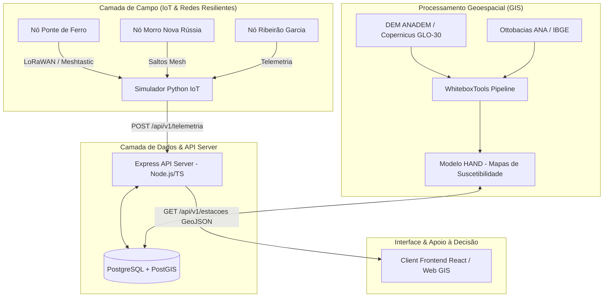

# 🛡️ Americas TechGuard - Plataforma para Monitoramento e Apoio a Inundações (PoC)

[](https://github.com/NyrxScar/Americas-TechGuard-Plataforma-para-Monitoramento-e-apoio-a-Inundacoes-PoC-)
[](https://nodejs.org)
[](https://postgis.net)
[](https://python.org)
[](https://meshtastic.org)

Plataforma integrada de **monitoramento hidrológico em tempo real, prevenção de desastres e apoio à tomada de decisão contra inundações**, desenvolvida como Proof of Concept (PoC) com foco na bacia do Rio Itajaí-Açú (município de Blumenau/SC).

---

## 📌 Visão Geral do Sistema

A plataforma **Americas TechGuard** combina tecnologia de redes resilientes IoT, geoprocessamento hidrológico avançado e arquitura de dados espacial para responder a desafios críticos em cenários de cheias extremas:

1. **Rede Mesh / LoRaWAN Resiliente**: Comunicação via rádio (Sub-GHz) entre nós de monitoramento físico e repetidores em cotas elevadas, garantindo o envio de telemetria mesmo em caso de queda de energia ou redes celulares.
2. **Modelo Hidrológico HAND (Height Above Nearest Drainage)**: Algoritmo de elevação relativa sobre a drenagem para mapeamento de suscetibilidade e manchas de inundação.
3. **API REST Espacial (PostGIS)**: Servidor Node.js/TypeScript preparado para ingerir telemetrias contínuas e servir geometrias em formato `GeoJSON` para consumo em dashboards GIS.
4. **Simulador de Campo**: Módulo em Python para envio de eventos estocásticos de cheia e telemetria de sensores.

---

## 🏗️ Arquitetura do Projeto



---

## 📂 Estrutura de Diretórios do Repositório

```text
Americas-TechGuard-Plataforma-para-Monitoramento-e-apoio-a-Inundacoes-PoC/
├── 📁 server/                 # API REST Backend (Node.js / Express / TypeScript)
│   ├── 📄 package.json
│   ├── 📄 tsconfig.json       # Configuração TypeScript
│   └── 📁 src/
│       ├── 📄 app.ts          # Configuração Express e rotas v1
│       ├── 📄 index.ts        # Ponto de entrada e servidor HTTP
│       ├── 📁 config/         # Conexão com pool PostgreSQL/PostGIS (database.ts)
│       ├── 📁 controllers/    # Controladores da API (telemetryController.ts)
│       ├── 📁 repositories/   # Acesso ao banco e queries espaciais (telemetryRepository.ts)
│       └── 📁 routes/         # Rotas da telemetria (/telemetria, /estacoes)
│
├── 📁 database/               # Esquema de Banco de Dados PostGIS & Seeds
│   ├── 📁 migrations/
│   │   └── 📄 001_create_postgis_tables.sql  # Tabelas estacoes_monitoramento e leituras_sensores
│   └── 📁 seeds/
│       └── 📄 01_estacoes_blumenau.sql       # Povoamento dos Nós da Rede Mesh de Blumenau
│
├── 📁 gis/                    # Processamento Geoespacial e Modelagem HAND
│   ├── 📄 calculoHandInteiro.py # Pipeline completo executável (IBGE/ANA, DEM, HAND 2D/3D)
│   ├── 📄 calculate_hand.py   # Script modular orquestrador do WhiteboxTools
│   ├── 📄 requirements.txt    # Dependências Python geoespaciais (Whitebox, GeoPandas, etc.)
│   ├── 📄 README.md           # Guia específico do módulo GIS
│   └── 📁 src/
│       └── 📄 visualization.py# Mapeamento estático e interativo (Folium, Matplotlib)
│
├── 📁 simulator/              # Simulador IoT de Telemetria e Sensores
│   ├── 📄 main.py             # Script principal da simulação Python
│   ├── 📄 risk_engine.py      # Cálculo de níveis de risco hidrológico
│   └── 📄 requirements.txt    # Dependências do simulador
│
├── 📁 client/                 # Interface do Usuário / Frontend Web GIS
│   └── 📁 src/                # Componentes React e visualizações
│
├── 📁 docs/                   # Documentação Técnica da Arquitetura
│   ├── 📄 architecture.md
│   ├── 📄 api-documentation.md
│   └── 📄 database-model.md
│
├── 📁 scripts/                # Scripts de Inicialização Automática (.ps1)
│   ├── 📄 setup.ps1           # Instalação geral de dependências
│   ├── 📄 run_server.ps1      # Execução da API
│   ├── 📄 run_simulator.ps1   # Execução do simulador
│   └── 📄 run_tests.ps1       # Bateria de testes
│
├── 📄 docker-compose.yml       # Orquestração da infraestrutura Docker (PostGIS)
├── 📄 .env.example            # Modelo de variáveis de ambiente
└── 📄 README.md               # Este documento
```

---

## ⚙️ Guia de Instalação e Execução Local

### 1. Pré-requisitos
* **Node.js**: v18+ 
* **Python**: v3.10+ (recomendado 3.12/3.13)
* **PostgreSQL**: v14+ com extensão **PostGIS** habilitada (ou Docker)

---

### 2. Configuração do Banco de Dados (PostGIS)

1. Crie o banco de dados PostgreSQL com o nome `americas_techguard` (ou altere no arquivo `.env`):
   ```sql
   CREATE DATABASE americas_techguard;
   ```
2. Execute os scripts de criação de tabelas e carga inicial na ordem:
   ```bash
   psql -U postgres -d americas_techguard -f database/migrations/001_create_postgis_tables.sql
   psql -U postgres -d americas_techguard -f database/seeds/01_estacoes_blumenau.sql
   ```

---

### 3. Execução da API Backend (`server/`)

1. Navegue até a pasta do servidor e instale as dependências:
   ```bash
   cd server
   npm install
   ```
2. Configure o arquivo `.env` com as credenciais do seu banco de dados:
   ```env
   PORT=3000
   DB_HOST=localhost
   DB_PORT=5432
   DB_USER=postgres
   DB_PASSWORD=sua_senha
   DB_NAME=americas_techguard
   ```
3. Inicie o servidor em modo de desenvolvimento:
   ```bash
   npm run dev
   ```
4. Verifique a saúde da API acessando: `http://localhost:3000/health`

---

### 4. Execução do Módulo GIS e Pipeline HAND (`gis/`)

1. Navegue até a pasta `gis/` e instale as dependências Python:
   ```bash
   cd gis
   pip install -r requirements.txt
   ```
2. Execute o pipeline completo HAND (Download de vetores, DEM, cálculo hidrológico e mapa de suscetibilidade):
   ```bash
   python calculoHandInteiro.py
   ```
   * O script gerará automaticamente os rasters na pasta `outputs_hand/` e o mapa interativo `mapa_ottobacias_blumenau.html`.

---

### 5. Execução do Simulador IoT (`simulator/`)

1. Navegue até a pasta `simulator/` e instale os pacotes:
   ```bash
   cd simulator
   pip install -r requirements.txt
   ```
2. Execute a simulação de sensores:
   ```bash
   python main.py
   ```

---

## 📡 Endpoints Principais da API REST

| Método | Rota | Descrição |
| :--- | :--- | :--- |
| `GET` | `/health` | Checagem de conectividade com a API e o banco PostGIS |
| `GET` | `/api/v1/estacoes` | Retorna os nós de monitoramento em formato **GeoJSON** |
| `POST` | `/api/v1/telemetria` | Ingestão de leituras de nível de água e chuva transmitidas pelos sensores |

---

## 📜 Licença

Este projeto é disponibilizado sob a licença **MIT**. Veja o arquivo [LICENSE](LICENSE) para mais detalhes.
